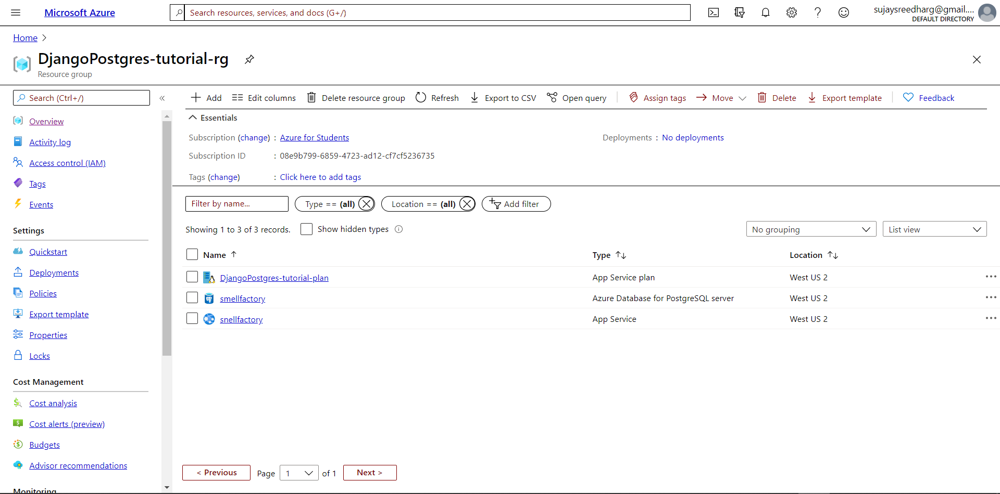

# Smellfactory Startup

 
 
 

 -  Developed a site using Bootstrap4 as the front end and added CSS animations.
  -   Created three SQL Models User, Post And Comment using Django ORM.
     
 
  -   Used django with SQLite as backend for local environment and converted it to Postgresql for production environment. 
  -   Deployed it on Microsoft Azure : Created an app service under a resource group and linked it to a postgresql server database. Hosted both of them in WEST US 2 to reduce the latency. 
   
 
  -  Incorporated pagination to improve user experience by 10\%.
  -   Authenticated users can write articles and publish them. Other users can comment and reply on a specific post by clicking on the View Comments button which takes them to a separate page where they can view all of the comments.
  -  Handled Customer Acquisition, User Service and Marketing using Social Media Branding and Added custom domain and added SSL binding to it to activate https protocol.
  
   -   Revamped the web application with frequent deployments and monitored build logs using github actions and reduced the number of http errors occuring in the site by handling errors effectively. 
   
  -  Only authenticated users can view add discussions in the forum section. If user tries to access these pages without login the user is redirected to the login page. 
  -   Authenticated users can write articles and publish them. Other users can comment and reply on a specific post by clicking on the View Comments button which takes them to a separate page where they can view all of the comments.

  -   FAQ section contains animated interactive cards which shows the Frequently Asked Questions.

  -   Current news section contains aesthetic articles and an embedded youtube video player which are mobile responsive.

  -   Footer section consists of the icons which take them to the respective media pages and a donate button which takes them to donate page.
 

List of pages the project contains:

  - Home
  - Login (/login)
  - Register (/register)
  - current news section (/smelltraining)
  - FAQ section (/senseofsmellfaq)
  - Discussion Forum (/forum)
  - Add & View Comments (To Add Comments or view comments of a Specific Post)
  - Donate
  - Logout

# Try Similar Version Of Site:  
https://smellfactory.herokuapp.com/

